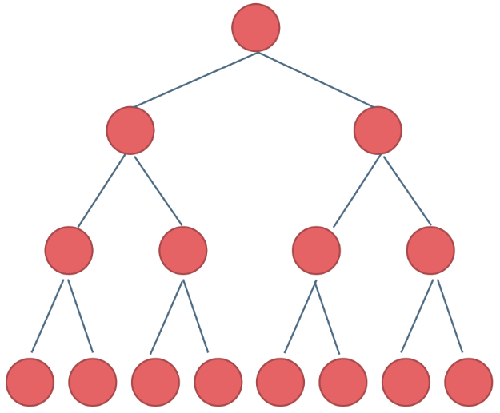

# 二叉树理论基础篇

## 二叉树的种类
解题过程中二叉树有两种主要的形式：满二叉树和完全二叉树。

### 满二叉树
如果一棵二叉树只有度为0的结点和度为2的结点，并且度为0的结点在同一层上，则这棵二叉树为满二叉树。

这棵二叉树为满二叉树，也可以说深度为k，有2^k-1个节点的二叉树

### 完全二叉树
除了最底层节点可能没填满外，其余每层节点数都达到最大值，并且最下面一层的节点都集中在该层最左边的若干位置。若最底层为第 h 层（h从1开始），则该层包含 1~ 2^(h-1) 个节点。

## 二叉树的存储方式

## 二叉树的遍历方式

## 二叉树的定义

# 二叉树的递归遍历

# 二叉树的迭代遍历

# 二叉树的统一迭代法