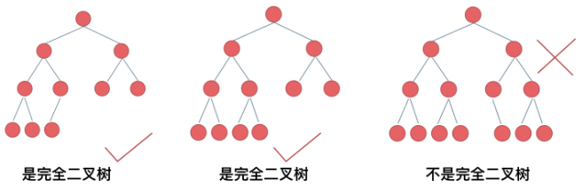

# 二叉树理论基础篇

## 二叉树的种类
解题过程中二叉树有两种主要的形式：满二叉树和完全二叉树。

### 满二叉树
如果一棵二叉树只有度为0的结点和度为2的结点，并且度为0的结点在同一层上，则这棵二叉树为满二叉树。

这棵二叉树为满二叉树，也可以说深度为k，有2^k-1个节点的二叉树

### 完全二叉树
除了最底层节点可能没填满外，其余每层节点数都达到最大值，并且最下面一层的节点都集中在该层最左边的若干位置。若最底层为第 h 层（h从1开始），则该层包含 1~ 2^(h-1) 个节点。


### 二叉搜索树
二叉搜索树是有数值的了，二叉搜索树是一个有序树。
* 若它的左子树不空，则左子树上所有结点的值均小于它的根结点的值；
* 若它的右子树不空，则右子树上所有结点的值均大于它的根结点的值；
* 它的左、右子树也分别为二叉排序树

### 平衡二叉搜索树
平衡二叉搜索树：又被称为AVL树，且具有以下性质：它是一棵空树或它的左右两个子树的高度差的绝对值不超过1，并且左右两个子树都是一棵平衡二叉树。
C++中map、set、multimap，multiset的底层实现都是平衡二叉搜索树

## 二叉树的存储方式
二叉树可以链式存储，也可以顺序存储。
链式存储方式就用指针， 顺序存储的方式就是用数组。
用数组来存储二叉树如何遍历的呢？
如果父节点的数组下标是 i，那么它的左孩子就是 i * 2 + 1，右孩子就是 i * 2 + 2。

## 二叉树的遍历方式
### 深度优先遍历
dfs 深度优先遍历：先往深走，遇到叶子节点再往回走。
* 前序遍历（递归法，迭代法）
* 中序遍历（递归法，迭代法）
* 后序遍历（递归法，迭代法）

这里前中后，其实指的就是中间节点的遍历顺序

### 广度优先遍历
bfs 广度优先遍历：一层一层的去遍历。
* 层次遍历（迭代法）

广度优先遍历的实现一般使用队列来实现

## 二叉树的定义
```c++
struct TreeNode {
    int val;
    TreeNode *left;
    TreeNode *right;
    TreeNode(int x) : val(x), left(NULL), right(NULL) {}
};
```

# 二叉树的递归遍历
递归三要素:
1. 确定递归函数的参数和返回值
2. 确定终止条件
3. 确定单层递归的逻辑

前序遍历 
[144.二叉树的前序遍历](https://leetcode.cn/problems/binary-tree-preorder-traversal/)
```c++
    void traversal(TreeNode* cur, vector<int>& vec) {
        if (cur == NULL) return;
        vec.push_back(cur->val);    // 中
        traversal(cur->left, vec);  // 左
        traversal(cur->right, vec); // 右
    }
```
中序遍历
[94.二叉树的中序遍历](https://leetcode.cn/problems/binary-tree-inorder-traversal/)
```c++
    void traversal(TreeNode* cur, vector<int>& vec) {
    if (cur == NULL) return;
    traversal(cur->left, vec);  // 左
    vec.push_back(cur->val);    // 中
    traversal(cur->right, vec); // 右
    }
```
后序遍历
[145.二叉树的后序遍历](https://leetcode.cn/problems/binary-tree-postorder-traversal/)
```c++
    void traversal(TreeNode* cur, vector<int>& vec) {
    if (cur == NULL) return;
    traversal(cur->left, vec);  // 左
    traversal(cur->right, vec); // 右
    vec.push_back(cur->val);    // 中
    }
```

# 二叉树的迭代遍历
用栈也可以是实现二叉树的前后中序遍历了

## 前序遍历（迭代法）
前序遍历是中左右，每次先处理的是中间节点，那么先将根节点放入栈中，然后将右孩子加入栈，再加入左孩子。这样出栈的时候才是中左右的顺序。
```c++
class Solution {
public:
    vector<int> preorderTraversal(TreeNode* root) {
        stack<TreeNode*> st;
        vector<int> result;
        if (root == NULL) return result;
        st.push(root);
        while (!st.empty()) {
            TreeNode* node = st.top();                       // 中
            st.pop();
            result.push_back(node->val);
            if (node->right) st.push(node->right);           // 右（空节点不入栈）
            if (node->left) st.push(node->left);             // 左（空节点不入栈）
        }
        return result;
    }
};
```

## 中序遍历（迭代法）
处理顺序和访问顺序是不一致的。
使用迭代法写中序遍历，就需要借用指针的遍历来帮助访问节点，栈则用来处理节点上的元素。
```c++
class Solution {
public:
    vector<int> inorderTraversal(TreeNode* root) {
        vector<int> result;
        stack<TreeNode*> st;
        TreeNode* cur = root;
        while (cur != NULL || !st.empty()) {
            if (cur != NULL) { // 指针来访问节点，访问到最底层
                st.push(cur); // 将访问的节点放进栈
                cur = cur->left;                // 左
            } else {
                cur = st.top(); // 从栈里弹出的数据，就是要处理的数据（放进result数组里的数据）
                st.pop();
                result.push_back(cur->val);     // 中
                cur = cur->right;               // 右
            }
        }
        return result;
    }
};
```

## 后序遍历（迭代法）
先序遍历是中左右，后续遍历是左右中,只需要调整一下先序遍历的代码顺序，就变成中右左的遍历顺序，然后在反转result数组，输出的结果顺序就是左右中了
```c++
class Solution {
public:
    vector<int> postorderTraversal(TreeNode* root) {
        stack<TreeNode*> st;
        vector<int> result;
        if (root == NULL) return result;
        st.push(root);
        while (!st.empty()) {
            TreeNode* node = st.top();
            st.pop();
            result.push_back(node->val);
            if (node->left) st.push(node->left); // 相对于前序遍历，这更改一下入栈顺序 （空节点不入栈）
            if (node->right) st.push(node->right); // 空节点不入栈
        }
        reverse(result.begin(), result.end()); // 将结果反转之后就是左右中的顺序了
        return result;
    }
};
```

# 二叉树的统一迭代法
将访问的节点放入栈中，把要处理的节点也放入栈中但是要做标记。
```c++
class Solution {
public:
    vector<int> inorderTraversal(TreeNode* root) {
        vector<int> result;
        stack<TreeNode*> st;
        if (root != NULL) st.push(root);
        while (!st.empty()) {
            TreeNode* node = st.top();
            if (node != NULL) {
                st.pop(); // 将该节点弹出，避免重复操作，下面再将右中左节点添加到栈中
                if (node->right) st.push(node->right);  // 添加右节点（空节点不入栈）

                st.push(node);                          // 添加中节点
                st.push(NULL); // 中节点访问过，但是还没有处理，加入空节点做为标记。

                if (node->left) st.push(node->left);    // 添加左节点（空节点不入栈）
            } else { // 只有遇到空节点的时候，才将下一个节点放进结果集
                st.pop();           // 将空节点弹出
                node = st.top();    // 重新取出栈中元素
                st.pop();
                result.push_back(node->val); // 加入到结果集
            }
        }
        return result;
    }
};
```

# 二叉树层序遍历
层序遍历一个二叉树。就是从左到右一层一层的去遍历二叉树。
需要借用一个辅助数据结构即队列来实现，队列先进先出，符合一层一层遍历的逻辑
这种层序遍历方式就是图论中的广度优先遍历
```c++
class Solution {
public:
    vector<vector<int>> levelOrder(TreeNode* root) {
        vector<vector<int>> result;
        queue<TreeNode*> que;
        if (root) que.push(root);
        while (!que.empty()) {
            int size = que.size();
            vector<int> vec;
            while (size--) {
                TreeNode* curr = que.front();
                que.pop();
                vec.push_back(curr->val);
                if (curr->left) que.push(curr->left);
                if (curr->right) que.push(curr->right);
            }
            result.push_back(vec);
        }
        return result;
    }
};
```
