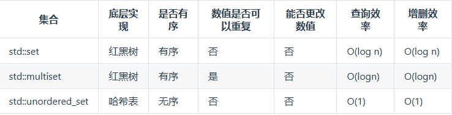
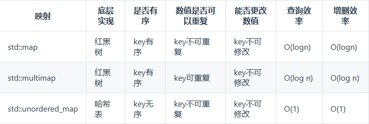

# 三、哈希表理论基础
## 哈希表
哈希表是根据关键码的值而直接进行访问的数据结构。
**当我们遇到了要快速判断一个元素是否出现集合里的时候，就要考虑哈希法。**

## 哈希函数
一般hashcode是通过特定编码方式，可以将其他数据格式转化为不同的数值
如果hashCode得到的数值大于 哈希表的大小了，再次对数值做一个取模的操作
index = hashFuncation();
hashFuncation = hashCode() % tableSize;

## 哈希碰撞
一般哈希碰撞有两种解决方法， 拉链法和线性探测法。
* 拉链法 
发生冲突的元素都被存储在链表中。拉链法就是要选择适当的哈希表的大小
* 线性探测法 
一定要保证tableSize大于dataSize。 我们需要依靠哈希表中的空位来解决碰撞问题。

## 常见的三种哈希结构
当我们想使用哈希法来解决问题的时候，我们一般会选择如下三种数据结构。
* 数组
* set（集合）
* map（映射）

>set:
**std::unordered_set**底层实现为哈希表，**std::set**和**std::multiset**的底层实现是红黑树。红黑树是一种平衡二叉搜索树，所以key值是有序的，但key不可以修改。

当要使用集合来解决哈希问题，优先使用 **unordered_set**，因为查询和增删效率是最优的，如果需要集合是有序的，那么就用**set**，如果要求不仅有序还要有重复数据的话，就用**multiset**。

>map:
**std::unordered_map**底层实现为哈希表，**std::map**和**std::multimap**的底层实现是红黑树。同理，std::map 和std::multimap 的key也是有序的（这个问题也经常作为面试题，考察对语言容器底层的理解）。

在map 是一个key value 的数据结构，map中，对key是有限制，对value没有限制的，因为key的存储方式使用红黑树实现的。
当要使用映射来解决哈希问题，优先使用 **unordered_map**，因为查询和增删效率是最优的，如果需要集合是有序的，那么就用**map**，如果要求不仅有序还要有重复数据的话，就用**multimap**。

# 242.有效的字母异位词(简单)
[力扣题目链接](https://leetcode.cn/problems/valid-anagram/)
给定两个字符串 s 和 t ，编写一个函数来判断 t 是否是 s 的字母异位词。
示例 1: 输入: s = "anagram", t = "nagaram" 输出: true
示例 2: 输入: s = "rat", t = "car" 输出: false
说明: 你可以假设字符串只包含小写字母。

## 哈希法 数组
时间复杂度: O(n)
空间复杂度: O(1)
首先判断两个字符串长度是否相等，不相等则直接返回 false。
若相等，则初始化 26 个字母哈希表，遍历字符串 s 和 t
s 在对应位置增加，t 在对应位置减少
如果哈希表的值都为 0，则二者是字母异位词
```c++
class Solution {
public:
    bool isAnagram(string s, string t) {
        if (s.size() != t.size()) //两字符串长度不等直接返回false
            return false;
        int alpha[26] = {0};
        for (int i = 0; i < s.size(); i++) {
            alpha[s[i] - 'a']++; //s增加记录
            alpha[t[i] - 'a']--; //t减少记录
        }
        for (int i = 0; i < 26; i++)
            if (alpha[i] != 0) //如果元素均为空，则说明符合字母异位词。
                return false;
        return true;
    }
};
```

# 349.两个数组的交集(简单)
[力扣题目链接](https://leetcode.cn/problems/intersection-of-two-arrays/)
给定两个数组 nums1 和 nums2 ，返回它们的交集。输出结果中的每个元素一定是唯一的。
我们可以不考虑输出结果的顺序 。
示例 ：
输入：nums1 = [1,2,2,1], nums2 = [2,2]
输出：[2]

## 哈希法 set
这道题目，主要要学会使用一种哈希数据结构：unordered_set，这个数据结构可以解决很多类似的问题。
注意题目特意说明：输出结果中的每个元素一定是唯一的，也就是说输出的结果的去重的，同时可以不考虑输出结果的顺序。
时间复杂度: O(mn)
空间复杂度: O(n)
```c++
class Solution {
public:
    vector<int> intersection(vector<int>& nums1, vector<int>& nums2) {
        unordered_set <int> cur(nums1.begin(),nums1.end());
        unordered_set <int> result; // 存放结果，使用set是为了给结果集去重，题目要求结果唯一
        for (int num : nums2) 
            if (cur.count(num)) result.insert(num);
            // 发现nums2的元素在cur里又出现过
        return vector<int>(result.begin(), result.end());
    }
};
```

## 哈希法 数组
时间复杂度: O(m + n)
空间复杂度: O(n)
```c++
class Solution {
public:
    vector<int> intersection(vector<int>& nums1, vector<int>& nums2) {
        unordered_set<int> result_set; // 存放结果，之所以用set是为了给结果集去重
        int hash[1005] = {0}; // 默认数值为0
        for (int num : nums1)  // nums1中出现的字母在hash数组中做记录
            hash[num] = 1;
        for (int num : nums2) { // nums2中出现话，result记录
            if (hash[num] == 1) 
                result_set.insert(num);
        }
        return vector<int>(result_set.begin(), result_set.end());
    }
};
```

# 202.快乐数(简单)
[力扣题目链接](https://leetcode.cn/problems/happy-number/)
编写一个算法来判断一个数 n 是不是快乐数。
快乐数定义为：
对于一个正整数，每一次将该数替换为它每个位置上的数字的平方和.
然后重复这个过程直到这个数变为 1，也可能是无限循环但始终变不到 1。
如果可以变为 1，那么这个数就是快乐数。
如果 n 是快乐数就返回 True ；不是，则返回 False 。
## 哈希法 set
当我们遇到了要快速判断一个元素是否出现集合里的时候，就要考虑哈希法了。
这道题使用哈希法，来判断这个sum是否重复出现，如果重复了就是return false，否则一直找到sum为1为止。
判断sum是否重复出现就可以使用unordered_set。
时间复杂度: O(logn)
空间复杂度: O(logn)
```c++
class Solution {
public:
    int nextN(int n) { //求和函数，
        int sum = 0;
        while (n) {
            sum += (n % 10) * (n % 10);
            n /= 10;
        }
        return sum;
    }
    bool isHappy(int n) {
        unordered_set<int> result;
        while (1) {
            int sum = nextN(n);
            if (sum == 1) return true;
            if (result.find(sum) != result.end()) return false;
             // 如果这个sum曾经出现过，说明已经陷入了无限循环了，立刻return false
            else result.insert(sum); //将和插入哈希表。
            n = sum;
        }
    }
};
```

## 双指针法 快慢指针
使用 “快慢指针” 思想，找出循环：“快指针” 每次走两步，“慢指针” 每次走一步，当二者相等时，即为一个循环周期。此时，判断是不是因为 1 引起的循环，是的话就是快乐数，否则不是快乐数。
```c++
class Solution {
public:
    vector<int> intersection(vector<int>& nums1, vector<int>& nums2) {
        unordered_set<int> result_set; // 存放结果，之所以用set是为了给结果集去重
        int hash[1005] = {0}; // 默认数值为0
        for (int num : nums1) { // nums1中出现的字母在hash数组中做记录
            hash[num] = 1;
        }
        for (int num : nums2) { // nums2中出现话，result记录
            if (hash[num] == 1) {
                result_set.insert(num);
            }
        }
        return vector<int>(result_set.begin(), result_set.end());
    }
};
```

# 1.两数之和(简单)
[力扣题目链接](https://leetcode.cn/problems/two-sum/)
给定一个整数数组 nums 和一个目标值 target，请你在该数组中找出和为目标值的那两个整数并返回他们的数组下标。
你可以假设每种输入只会对应一个答案。但是，数组中同一个元素不能使用两遍。
示例:
给定 nums = [2, 7, 11, 15], target = 9
因为 nums[0] + nums[1] = 2 + 7 = 9
所以返回 [0, 1]

## 哈希法 map
本题不仅要知道元素有没有，还要知道元素对应的下标，需要使用key value结构来存放
key来存元素，value来存下标，使用map正合适。
map用来存放访问过的元素，记录遍历过的元素和对应的下标，这样能找到与当前元素相匹配的（也就是相加等于target）
map中key和value分别表示什么：
这道题需要判断这个元素是否出现过，如果出现过，返回这个元素的下标。
那么判断元素是否出现，这个元素就作为key，所以数组中的元素作为key，value用来存下标。
所以 map中的存储结构为 {key：数据元素，value：数组元素对应的下标}。
时间复杂度: O(n)
空间复杂度: O(n)
```c++
class Solution {
public:
    vector<int> twoSum(vector<int>& nums, int target) {
        unordered_map <int, int> result;
        for (int i = 0; i < nums.size(); i++) {
            if (result.find(target - nums[i]) != result.end()) 
                return {result.find(target - nums[i])->second, i};
             result.insert(pair<int, int>(nums[i], i));
        }
        return {};
    }
};
```

# 454.四数相加II(中等)
[力扣题目链接](https://leetcode.cn/problems/4sum-ii/)
给你四个整数数组 nums1、nums2、nums3 和 nums4 ，数组长度都是 n ，请你计算有多少个元组 (i, j, k, l) 能满足：
- 0 <= i, j, k, l < n
- nums1[i] + nums2[j] + nums3[k] + nums4[l] == 0
## 哈希法 map
这道题目是四个独立的数组，只要找到A[i] + B[j] + C[k] + D[l] = 0就可以，不用考虑有重复的四个元素相加等于0的情况。
1. 首先定义一个unordered_map，key放a和b两数之和，value放a和b两数之和出现的次数。
2. 遍历A和B数组，统计两个数组元素之和，和出现的次数，放到map中。
3. 定义int变量count，用来统计 a+b+c+d = 0 出现的次数。
4. 遍历C和D数组，找到如果 0-(c+d) 在map中出现过，map中key对应的value即出现次数加到count上。
5. 最后返回统计值 count 就可以了
> 为什么使用map，因为是四个独立数组，不仅需要记录两个数之和，还要记录出现的次数，因此map最合适。
> key : 两数之和   value : 出现次数

时间复杂度: O(n^2)
空间复杂度: O(n^2)
```c++
class Solution {
public:
    int fourSumCount(vector<int>& nums1, vector<int>& nums2, vector<int>& nums3, vector<int>& nums4) {
        unordered_map<int,int> map; //key:a+b的数值，value:a+b数值出现的次数
        for (int i : nums1) {
            for (int j : nums2) //统计两个数组元素之和，和出现的次数，放到map中
                map[i + j]++;
        }
        int count = 0;
        for (int k : nums3) {
            for (int l : nums4) { 
    //遍历后两个数组，如果 0-(k+l) 在map中出现过的话，就把map中key对应的value即出现次数加到count上
                int target = 0 - (k + l);
                if (map.find(target) != map.end()) 
                    count += map[target];
            }
        }
        return count;
    }
};
```

# 383.赎金信(简单)
[力扣题目链接](https://leetcode.cn/problems/ransom-note/) 
给定一个赎金信 (ransom) 字符串和一个杂志(magazine)字符串，判断第一个字符串 ransom 能不能由第二个字符串 magazines 里面的字符构成。
如果可以构成，返回 true ；否则返回 false。magazine 中的每个字符只能在 ransomNote 中使用一次。
ransomNote 和 magazine 由小写英文字母组成。
## 哈希法 数组
因为题目只有小写字母，可以采用空间换取时间的哈希策略，用一个长度26的数组记录magazine里字母出现的次数。
然后再用ransomNote去验证这个数组是否包含了ransomNote所需要的所有字母。依然是数组在哈希法中的应用。
> 思考：为什么不用万能的map？ 什么情况用数组？
> map要维护红黑树或者哈希表，而且还要做哈希函数，是费时的！数组更加简单直接有效！
> 当范围有限制，哈希值较小可以采用数组来做哈希表。

时间复杂度: O(n)
空间复杂度: O(1)
```c++
class Solution {
public:
    bool canConstruct(string ransomNote, string magazine) {
        if (ransomNote.length() > magazine.length()) 
            return false;
        int hash[26] = {0};
        for (int i : magazine) 
            hash[i - 'a']++;
        for (int i : ransomNote) {
            hash[i - 'a']--;
            if (hash[i - 'a'] < 0)
                return false;
        }
        return true;
    }
};
```

# 15.三数之和(中等)
[力扣题目链接](https://leetcode.cn/problems/3sum/)
给你一个整数数组 nums ，判断是否存在三元组 {nums[i], nums[j], nums[k]} 满足 i != j、i != k 且 
j != k ，同时还满足 nums[i] + nums[j] + nums[k] == 0 。
请你返回所有和为 0 且不重复的三元组。
注意：答案中不可以包含重复的三元组。
示例：
给定数组 nums = [-1, 0, 1, 2, -1, -4]，
满足要求的三元组集合为： [ [-1, 0, 1], [-1, -1, 2] ]

## 双指针
其实这道题目使用哈希法并不十分合适，因为在去重的操作中有很多细节需要注意。
1. 首先将数组排序，然后有一层for循环，i从下标0的地方开始（代表第一个数），同时定一个下标left定义在i+1的位置上（代表第二个数），定义下标right 在数组结尾的位置上（代表第三个数）。
2. 如果nums[i] + nums[left] + nums[right] > 0 就说明三数之和大了，因为数组是排序后了，所以right下标就应该向左移动，这样才能让三数之和小一些。
如果 nums[i] + nums[left] + nums[right] < 0 说明三数之和小了，left 就向右移动，才能让三数之和大一些，直到left与right相遇为止。
时间复杂度: O(n^2)
空间复杂度: O(1)
```c++
class Solution {
public:
    vector<vector<int>> threeSum(vector<int>& nums) {
        vector<vector<int>> result;
        sort(nums.begin(), nums.end());
        for (int i = 0; i < nums.size(); i++) {
            if (nums[i] > 0) return result;
            if (i > 0 && nums[i] == nums[i - 1]) continue;
            int left = i + 1;
            int right = nums.size() - 1;
            while (left < right) {
                if ((nums[i] + nums[left] + nums[right]) > 0) right--; 
                else if ((nums[i] + nums[left] + nums[right]) < 0) left++;
                else {
                    result.push_back({nums[i], nums[left], nums[right]});
                    while (left < right && nums[left] == nums[left + 1]) left++;
                    while (left < right && nums[right] == nums[right - 1]) right--;
                    left++;
                    right--;
                }
            }
        }
        return result;
    }
};
```

# 18.四数之和(中等)
[力扣题目链接](https://leetcode.cn/problems/4sum/)
给你一个由 n 个整数组成的数组 nums ，和一个目标值 target 。请你找出并返回满足下述全部条件且不重复的四元组 [ nums[a], nums[b], nums[c], nums[d] ] （若两个四元组元素一一对应，则认为两个四元组重复）：
0 <= a, b, c, d < n
a、b、c 和 d 互不相同
nums[a] + nums[b] + nums[c] + nums[d] == target
你可以按任意顺序返回答案 。

## 双指针 + 下标
两层for循环，用下标i, j先确定两个数。 双指针l, r开始收集符合要求的另两个数(即 i+j+l+r = target) 
注意剪枝和去重细节
时间复杂度: O(n^3)
空间复杂度: O(1)
```c++
class Solution {
public:
    vector<vector<int>> fourSum(vector<int>& nums, int target) {
        vector<vector<int>> result; //存放结果
        sort(nums.begin(), nums.end()); //排序
        for (int i = 0; i < nums.size(); i++) { //i遍历第一个数
            if (nums[i] > target && target >= 0) break; //i剪枝
            if (i > 0 && nums[i] == nums[i - 1]) continue; //i去重           
            for (int j = i + 1; j < nums.size(); j++) { //j遍历第二个数
                if (nums[i] + nums[j] > target && target >= 0) break; //二级j剪枝
                if (j > i + 1 && nums[j] == nums[j - 1]) continue; //二级j去重
                int l = j + 1;
                int r = nums.size() - 1;
                while (l < r) {
                    long sum = (long)nums[i] + nums[j] + nums[l] + nums[r]; //防溢出
                    if (sum < target) l++;
                    else if (sum > target) r--;
                    else {
                        result.push_back({nums[i],nums[j],nums[l],nums[r]}); //存放到结果
                        while (l < r && nums[l] == nums[l + 1]) l++; //left去重
                        while (l < r && nums[r] == nums[r - 1]) r--; //right去重
                        l++;
                        r--; 
                    }
                }
            }
        }
        return result;
    }
};
```

# 哈希表总结
**一般来说哈希表都是用来快速判断一个元素是否出现集合里。**
对于哈希表，要知道哈希函数和哈希碰撞在哈希表中的作用。
哈希函数 是把传入的key映射到符号表的索引上。
哈希碰撞 处理有多个key映射到相同索引上时的情景，处理碰撞的普遍方式是拉链法和线性探测法。
接下来是常见的三种哈希结构：
- 数组
- set（集合）
- map（映射）

## 数组:
> 数组就可以是一个哈希表
> 当数值大小有限制时，使用数组做哈希比set、map更合适，效率更高。因为set、map底层实现有更大的开销。
> 当数值大小没有限制，或者哈希值较小，比较分散，跨度很大时，就不适合用数组了，会造成空间浪费。
例如题 242.有效的字母异位词 / 383.赎金信 

## set:
> unordered_set、set 、multiset
> std::unordered_set底层实现为哈希表，std::set 和 std::multiset 的底层实现是红黑树。
> 当我们要使用集合来解决哈希问题的时候，优先使用unordered_set，因为它的查询和增删效率是最优的。
> 如果需要集合是有序的，那么就用set，如果要求不仅有序还要有重复数据的话，那么就用multiset。
例如题 349.两个数组的交集 / 202.快乐数

## map:
> unordered_map、map 、multimap
> map 是一个key、value 的数据结构，map中，对key是有限制，对value没有限制的。
> 当题目需要存放两个信息<key,value>，比如数值大小和下标，应该使用map,优先使用unordered_map。
> 如果需要集合是有序的，那么就用map，如果要求不仅有序还要有重复数据的话，那么就用multimap。
例如题 1.两数之和 / 454.四数相加II