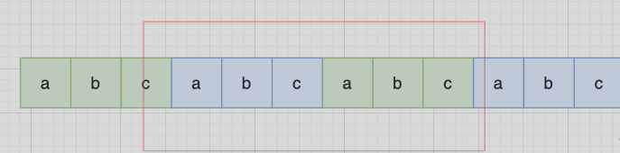

1. [反转字符串](#1)
2. [反转字符串II](#2)
3. [替换数字](#3)
4. [翻转字符串里的单词](#4)
5. [右旋字符串](#5)
6. [实现 strStr()](#6)
7. [重复的子字符串](#7)

# 四、字符串(7)

# 344.反转字符串(简单) <a id="1"></a>
[力扣题目链接](https://leetcode.cn/problems/reverse-string/)
编写一个函数，其作用是将输入的字符串反转过来。输入字符串以字符数组 s 的形式给出。
不要给另外的数组分配额外的空间，你必须原地修改输入数组、使用 O(1) 的额外空间解决这一问题。
s[i] 都是 ASCII 码表中的可打印字符。

## 双指针
时间复杂度: O(n)
空间复杂度: O(1)
```c++
class Solution {
public:
    void reverseString(vector<char>& s) {
        for (int i = 0, j = s.size() - 1; i < s.size()/2; i++, j--) {
            swap(s[i],s[j]);
        }
    }
};
```

# 541. 反转字符串II(简单) <a id="2"></a>
[力扣题目链接](https://leetcode.cn/problems/reverse-string-ii/)
给定一个字符串 s 和一个整数 k，从字符串开头算起,每计数至 2k 个字符，就反转这 2k 个字符中的前k个字符。
如果剩余字符少于 k 个，则将剩余字符全部反转。
如果剩余字符小于 2k 但大于或等于 k 个，则反转前 k 个字符，其余字符保持原样。
## 双指针
当需要固定规律一段一段去处理字符串的时候，要想想在for循环的表达式上做做文章。
时间复杂度: O(n)
空间复杂度: O(1)
```c++
class Solution {
public:
    string reverseStr(string s, int k) {
        for (int i = 0; i < s.size(); i += 2 * k) {
            if (i + k <= s.size()) 
                reverse(s.begin() + i, s.begin() + i + k);
            else 
                reverse(s.begin() + i, s.end());
        }
        return s;
    }
};
```

# 替换数字 <a id="3"></a>
[力扣题目链接](https://kamacoder.com/problempage.php?pid=1064)
给定一个字符串 s，它包含小写字母和数字字符，请编写一个函数，将字符串中的字母字符保持不变，而将每个数字字符替换为number。
示例： 输入：a1b2c3
输出：anumberbnumbercnumber
## 双指针
首先扩充数组到每个数字字符替换成 "number" 之后的大小。然后从后向前替换数字字符，也就是双指针法
时间复杂度：O(n)
空间复杂度：O(1)
```c++
#include <iostream>
#include <string>
using namespace std;

int main() {
    string s;
    cin>> s;
    int count = 0;
    for (int i = 0; i < s.size(); i++) {
        if (s[i] >= '0' && s[i] <= '9') count++;
    }
    int oldsize = s.size();
    s.resize(s.size() + 5 * count);
    int newsize = s.size();
    for (int i = oldsize, j = newsize; i < j; i--, j--) {
        if (s[i] < '0' || s[i] > '9') {
            s[j] = s[i];
        } else {
            s[j] = 'r';
            s[j - 1] = 'e';
            s[j - 2] = 'b';
            s[j - 3] = 'm';
            s[j - 4] = 'u';
            s[j - 5] = 'n';
            j -= 5;
        }
    }
    cout << s;
}
```

# 151.翻转字符串里的单词 <a id="4"></a>
[力扣题目链接](https://leetcode.cn/problems/reverse-words-in-a-string/)
给定一个字符串，逐个翻转字符串中的每个单词。
示例 ：
输入: "the sky is blue"
输出: "blue is sky the"

## 双指针
* 移除多余空格
* 将整个字符串反转
* 将每个单词反转
时间复杂度: O(n)
空间复杂度: O(1) 或 O(n)，取决于语言中字符串是否可变
```c++
class Solution {
public:
    void reverse(string& s, int start, int end){ //翻转，区间写法：左闭右闭 []
        for (int i = start, j = end; i < j; i++, j--) 
            swap(s[i], s[j]);
    }

    void removeExtraSpaces(string& s) {//去除所有空格并在相邻单词之间添加空格, 快慢指针。
        int slow = 0;   
        for (int i = 0; i < s.size(); ++i) { 
            if (s[i] != ' ') { //遇到非空格就处理，即删除所有空格。
                if (slow != 0) s[slow++] = ' '; //手动控制空格，给单词之间添加空格。slow != 0说明不是第一个单词，需要在单词前添加空格。
                while (i < s.size() && s[i] != ' ')  //补上该单词，遇到空格说明单词结束。
                    s[slow++] = s[i++];
            }
        }
        s.resize(slow); //slow的大小即为去除多余空格后的大小。
    }

    string reverseWords(string s) {
        removeExtraSpaces(s); //去除多余空格，保证单词之间之只有一个空格，且字符串首尾没空格。
        reverse(s, 0, s.size() - 1);
        int start = 0; //removeExtraSpaces后保证第一个单词的开始下标一定是0。
        for (int i = 0; i <= s.size(); ++i) {
            if (i == s.size() || s[i] == ' ') { //到达空格或者串尾，说明一个单词结束。进行翻转。
                reverse(s, start, i - 1); //翻转，注意是左闭右闭 []的翻转。
                start = i + 1; //更新下一个单词的开始下标start
            }
        }
        return s;
    }
};
```

# 右旋字符串 <a id="5"></a>
[题目链接](https://kamacoder.com/problempage.php?pid=1065)
给定一个字符串 s 和一个正整数 k，请编写一个函数，将字符串中的后面 k 个字符移到字符串的前面，实现字符串的右旋转操作。 
输入描述:输入共包含两行，第一行为一个正整数 k，代表右旋转的位数。第二行为字符串 s，代表需要旋转的字符串。
输出描述:输出共一行，为进行了右旋转操作后的字符串。
输入示例:
2
abcdefg
输出示例:
fgabcde
## 反反得正
思路就是 通过 整体倒叙，把两段子串顺序颠倒，两个段子串里的的字符在倒叙一把，负负得正，这样就不影响子串里面字符的顺序了。

```c++
#include <iostream>
#include <algorithm>
using namespace std;

int main() {
    int k; string s;
    cin >> k >> s;
    reverse(s.begin(), s.end());
    reverse(s.begin(), s.begin() + k);
    reverse(s.begin() + k, s.end());
    cout << s;
}
```
# 28.实现 strStr() <a id="6"></a>
[题目链接](https://leetcode.cn/problems/find-the-index-of-the-first-occurrence-in-a-string/)
实现 strStr() 函数。
给定一个 haystack 字符串和一个 needle 字符串，在 haystack 字符串中找出 needle 字符串出现的第一个位置 (从0开始)。如果不存在，则返回  -1。
示例 1: 输入: haystack = "hello", needle = "ll" 输出: 2
示例 2: 输入: haystack = "aaaaa", needle = "bba" 输出: -1
## KMP算法
### KMP的作用
KMP主要应用在字符串匹配上。
KMP的主要思想是当出现字符串不匹配时，可以知道一部分之前已经匹配的文本内容，可以利用这些信息避免从头再去做匹配了。
### 前缀表
next数组就是一个前缀表（prefix table）
前缀表是用来回退的，它记录了模式串与主串(文本串)不匹配的时候，模式串应该从哪里开始重新匹配。
### 最长相同前后缀
前缀是指不包含最后一个字符的所有以第一个字符开头的连续子串。
后缀是指不包含第一个字符的所有以最后一个字符结尾的连续子串。
前缀表要求的就是最长相同前后缀的长度。
### 前缀表 next 构造方法
1. 初始化
2. 处理前后缀不相同
3. 处理前后缀相同

时间复杂度: O(n + m)
空间复杂度: O(m)
```c++
class Solution {
public:
    void getnext(int next[], const string& s) {
        // 1.初始化 2.前后缀不相等 3.前后缀相等
        int j = 0; //j 前缀末尾 从0开始
        next[0] = 0; // 起始位置只有一个字符 所以为0
        for (int i = 1; i < s.size(); i++) { // i 后缀末尾
            while (j > 0 && s[j] != s[i]) 
                j = next[j - 1]; // 不相等 j回退 直到为0或相等
            if (s[j] == s[i]) j++; //相等 j, i 往后走
            next[i] = j; // i 位置的 最长相等前后缀
        }
    }

    int strStr(string haystack, string needle) {
        int n = needle.size();
        if (n == 0) return 0;
        int next[n];
        getnext(next, needle);
        int j = 0;
        for (int i = 0; i < haystack.size(); i++) {
            while (j > 0 && needle[j] != haystack[i]) 
                j = next[j - 1];
            if (needle[j] == haystack[i]) j++;
            if (j == n) return i - n + 1;  // j == n 说明模式串已全部匹配 
        }
        return -1;
    }
};
```

# 459.重复的子字符串 <a id="7"></a>
[力扣题目链接](https://leetcode.cn/problems/repeated-substring-pattern/)
给定一个非空的字符串，判断它是否可以由它的一个子串重复多次构成。给定的字符串只含有小写英文字母，并且长度不超过10000。
## 移动匹配
当一个字符串（如s：abcabc），内部由重复的子串组成，那么这个字符串的结构一定是由前后相同的子串组成，既然前面有相同的子串，后面有相同的子串，用 s + s，这样组成的字符串中，后面的子串做前串，前面的子串做后串，就一定还能组成一个s

所以判断字符串s是否由重复子串组成，只要两个s拼接在一起，里面还出现一个s的话，就说明是由重复子串组成。**要刨除 s + s 的首字符和尾字符**
时间复杂度: O(n)
空间复杂度: O(1)
```c++
class Solution {
public:
    bool repeatedSubstringPattern(string s) {
        string t = s + s;
        t.erase(t.begin()); t.erase(t.end() - 1); // 掐头去尾
        if (t.find(s) != std::string::npos) return true; // r
        return false;
    }
};
```

## KMP
在由重复子串组成的字符串中，最长相等前后缀不包含的子串就是最小重复子串

如果len % (len - (next[len - 1] + 1)) == 0 ，则说明数组的长度正好可以被 (数组长度-最长相等前后缀的长度) 整除 ，说明该字符串有重复的子字符串。
时间复杂度: O(n)
空间复杂度: O(n)
```c++
class Solution {
public:
    bool repeatedSubstringPattern(string s) {
        int n = s.size();
        int next[n];
        int j = 0;
        next[0] = 0;
        for (int i = 1; i < n; i++) {
            while (j > 0 && s[i] != s[j]) j = next[j - 1];
            if (s[i] == s[j]) j++;
            next[i] = j;
        }
        return next[n - 1] != 0 && n % (n - next[n - 1]) == 0;
    }
};
```
# 总结
## 什么是字符串
字符串是若干字符组成的有限序列，也可以理解为是一个字符数组
在C语言中，把一个字符串存入一个数组时，也把结束符 '\0'存入数组，并以此作为该字符串是否结束的标志。
在C++中，提供一个string类，string类会提供 size接口，可以用来判断string类字符串是否结束
vector< char > 和 string 在基本操作上没有区别，但是 string提供更多的字符串处理的相关接口。

## 要不要使用库函数
打基础的时候，不要太迷恋于库函数。
如果题目关键的部分直接用库函数就可以解决，建议不要使用库函数。

## 双指针法
双指针法在数组，链表和字符串中很常用。
在[反转字符串](#1) 使用双指针法实现了反转字符串的操作
在[替换数字](#3)，同样还是使用双指针法在时间复杂度O(n)的情况下完成替换。其实很多数组填充类的问题，都可以先预先给数组扩容带填充后的大小，然后在从后向前进行操作。
在[翻转字符串里的单词](#4)中我们使用O(n)的时间复杂度，完成了删除冗余空格。

## 反转系列
[反转字符串II](#2)，其实当需要固定规律一段一段去处理字符串的时候，要想想在在for循环的表达式上做文章。
在[翻转字符串里的单词](#4)中要求翻转字符串里的单词，这道题目可以说是综合考察了字符串的多种操作。是考察字符串的好题。 先整体反转再局部反转，实现了反转字符串里的单词。

## KMP
KMP的主要思想是当出现字符串不匹配时，可以知道一部分之前已经匹配的文本内容，可以利用这些信息避免从头再去做匹配了。
KMP的精髓所在就是前缀表，前缀表：起始位置到下标i之前（包括i）的子串中，有多大长度的相同前缀后缀。
那么使用KMP可以解决两类经典问题：
匹配问题：[实现 strStr()](#6)
重复子串问题：[重复的子字符串](#7)
前缀：指不包含最后一个字符的所有以第一个字符开头的连续子串。
后缀：指不包含第一个字符的所有以最后一个字符结尾的连续子串。
